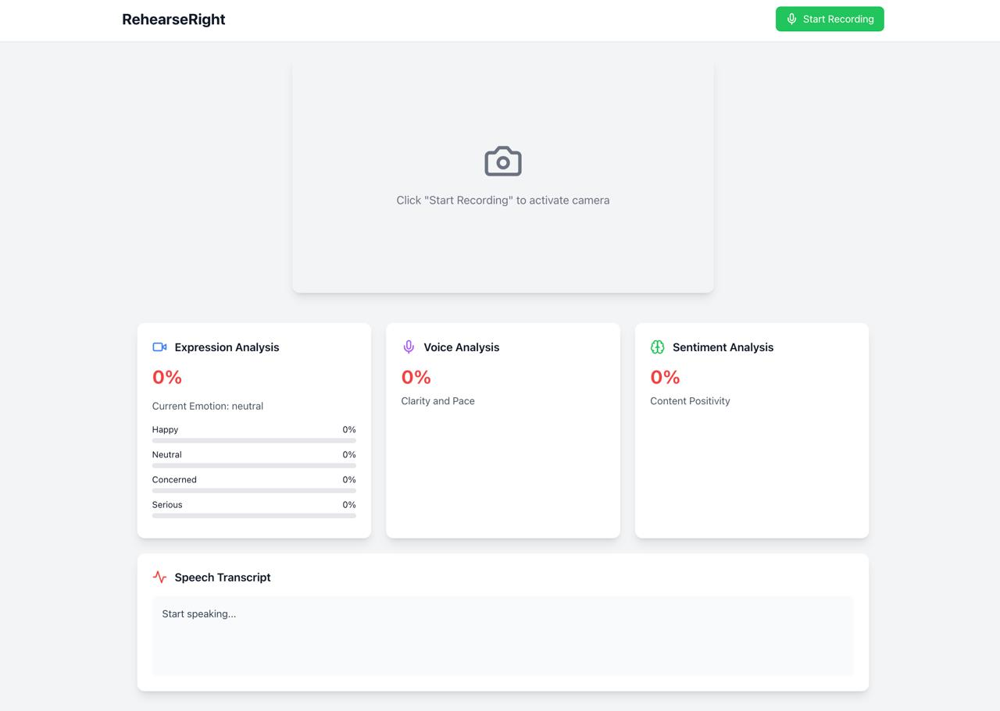

# RehearseRight

AI-based emotion recognition and feedback tool for public speaking training



## Features

- Real-time facial expression analysis
- Voice tone analysis (clarity, pace, volume)
- Speech sentiment analysis
- Speech-to-text
- Live feedback and post-presentation summary
- Beautiful, responsive UI

## Prerequisites

- Python 3.9+
- Node.js 18+
- Docker (optional)

## Project Structure

```
.
├── backend/
│   ├── models/
│   │   ├── emotion_detector.py
│   │   ├── voice_analyzer.py
│   │   └── sentiment_analyzer.py
│   ├── websocket_manager.py
│   ├── main.py
│   ├── requirements.txt
│   └── Dockerfile
├── src/
│   ├── components/
│   ├── hooks/
│   └── ...
├── docker-compose.yml
└── README.md
```

## Setup Instructions

### Backend Setup

1. Create a Python virtual environment:
   ```bash
   cd backend
   python -m venv venv
   source venv/bin/activate  # On Windows: venv\Scripts\activate
   ```

2. Install dependencies:
   ```bash
   pip install -r requirements.txt
   ```

3. Download the emotion detection model:
   ```bash
   mkdir models
   # Download a pre-trained FER model and save as models/emotion_model.h5
   # You can use models from TensorFlow Hub or train your own
   ```

4. Start the backend server:
   ```bash
   uvicorn main:app --host 0.0.0.0 --port 8000 --reload
   ```

### Frontend Setup

1. Install dependencies:
   ```bash
   npm install
   ```

2. Create `.env` file:
   ```
   VITE_WS_URL=ws://localhost:8000
   ```

3. Start the development server:
   ```bash
   npm run dev
   ```

### Docker Setup (Optional)

1. Build and run using Docker Compose:
   ```bash
   docker-compose up --build
   ```

## Usage

1. Open the application in your browser
2. Grant camera and microphone permissions
3. Click "Start Recording" to begin analysis
4. Present your content
5. Click "Stop Recording" to see the analysis summary

## Technical Details

### Backend

- FastAPI for the web server
- TensorFlow for emotion detection
- librosa for voice analysis
- Transformers for sentiment analysis
- WebSocket for real-time communication

### Frontend

- React with TypeScript
- Tailwind CSS for styling
- Framer Motion for animations
- WebSocket for real-time updates

## Troubleshooting

1. WebSocket Connection Issues:
   - Ensure backend server is running
   - Check VITE_WS_URL in .env
   - Verify CORS settings

2. Camera/Microphone Access:
   - Grant browser permissions
   - Ensure no other apps are using the devices

3. Model Loading Issues:
   - Verify model files are in correct location
   - Check Python environment has required dependencies